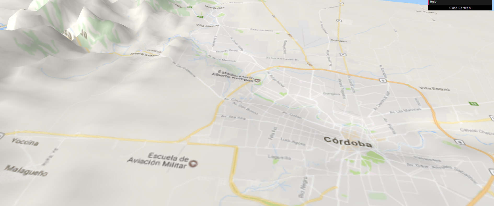

# Ciudad de Cordoba, altitud del terreno

Se tomo una imagen de alta calidad del terreno de la Ciudad de Córdoba (desde [este sitio](http://srtm.csi.cgiar.org/SELECTION/inputCoord.asp)) y se uso como base para un mapa 3D de altitud del terreno.   

Se uso la herramienta libre QGIS con el plugin Qgis2ThreeJS que genera automáticamente la visualización 3D con javascript.
Se exageraron levemete las diferencias de altitud para hacerlas más notables.  

[Aquí](https://modernizacionmunicba.github.io/Cordoba-altitud-del-terreno/) puede navegarse con mouse y teclado online.  
